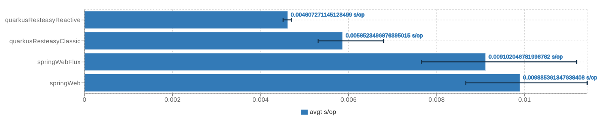
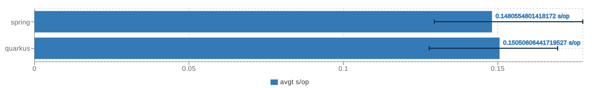

# Benchmark Results

API Framework Versions:
- Quarkus 1.8.0.Final
- Spring Boot 2.6.6

## For Simple REST application

Simple REST GET endpoint that returns a static string.
Module: [Rest Benchmark](rest-benchmark)
Source Code:

```java
import javax.ws.rs.GET;
import javax.ws.rs.Path;
import javax.ws.rs.Produces;
import javax.ws.rs.core.MediaType;

@Path("/ping")
public class PingResource {

    @GET
    @Produces(MediaType.TEXT_PLAIN)
    public String ping() {
        return "pong";
    }
}
```

- Throughput


- Average Time



- Single Shot-Time


## For Data Blocking application

Using blocking API to connect to a PostgreSQL database instance. This benchmark will create a fruit, will get this fruit and finally it will delete it. 

Module: [Data Blocking Benchmark](data-blocking-benchmark)
Source Code:

```java
@Entity
public class Fruit {
    @Id
    @GeneratedValue
    private Long id;
    private String name;
}

@ApplicationScoped
public class FruitRepository {
    // ...
}

@Path("/api/fruits")
public class FruitResource {

    @Inject
    FruitRepository repository;

    @GET
    @Path("/{id}")
    public Fruit get(@PathParam("id") Long id) {
        // ...
    }

    @POST
    public Fruit post(Fruit fruit) {
        // ...
    }

    @DELETE
    @Path("/{id}")
    public void delete(@PathParam("id") Long id) {
        // ...
    }

}
```

- Throughput


- Average Time



- Single Shot-Time


## For Data Reactive application

Same application as in [Data Blocking application](#for-data-blocking-application) but using the Reactive API for both Quarkus and Spring. 

- Throughput


- Average Time


- Single Shot-Time

